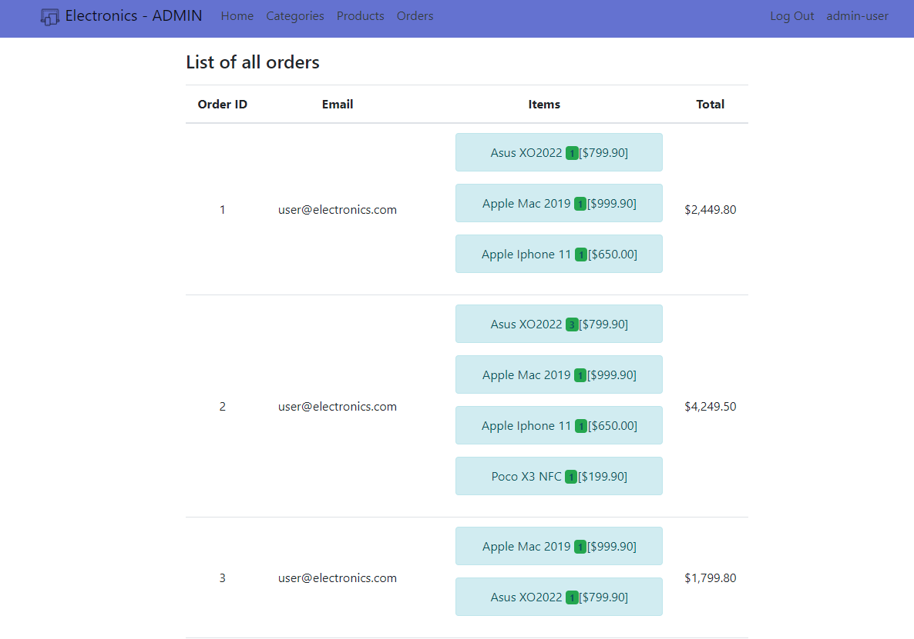
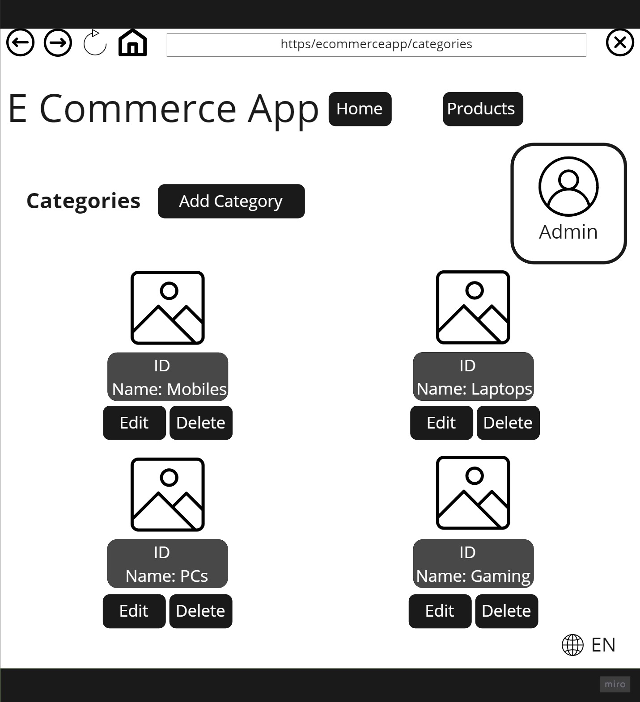

# Table of Contents 

1. [INTRODUCTION](#INTRODUCTION)
2. [Wireframes](#WF)
3. [User Stories](#US)
4. [Entity Relationship Diagram](#ERD)
5. [Website Preview](#WP)

 
 
# Introduction 

An E-Commerce web application for an electronics store.

Contains Admin Dashboard for Adding, Editing & Deleting categories or products.

Good user experience with cart and online shopping implemented.

### Name of contributors:
1. Shadi Aslan
2. Abdulrahman Jaran

### Link to [Deployed site](https://electronics-storedbcontext.azurewebsites.net)

 
 
## Technology

We used ASP.NET Version (5.0.17 )

 

[↑ Table Of Contents ↑](#TB)

 

 
 

# User Stories:

### Admin: 
As an Admin I would like to have a dashboard where I can:  

1. See a list of my categories with the ability to create, edit & delete.
2. See a list of my products, with the ability to create, edit & delete.
3. See a list of my products, with the ability to create, edit & delete.
4. See a list of all the purchases made by users.

### Editor: 
As an editor, I would like to be able to:

1. Edit information of categories & products.
2. Associate a product with a category.

### User:
As a user, I would like to have all my content rendered to me in razor pages, and I also want the ability to:

1. View all the categories.
2. View all the products with specific details like price, release date & maker name.
3. Sign into my account, or sign up for a new one.
4. Add items to cart.
5. Have a live update of the amount of unique items in my cart at all times while I am browsing the website.
6. Recieve a thank you message once I complete a purchase.
7. Recieve an email with the summary of my purchase.

 

[↑ Table Of Contents ↑](#TB)

 

 
 

# Entity Relationship Diagram 

[↑ Table Of Contents ↑](#TB)

# Website Preview 

1. User Categories Page:

2. User Products Page:

2. User Cart Page:

3. Admin Categories Page:

4. Admin Products Page:

5. Admin Orders View:

6. Sign in

 
 
# Wireframes: 

### Categories

### Product Details Page

 

[↑ Table Of Contents ↑](#TB)
